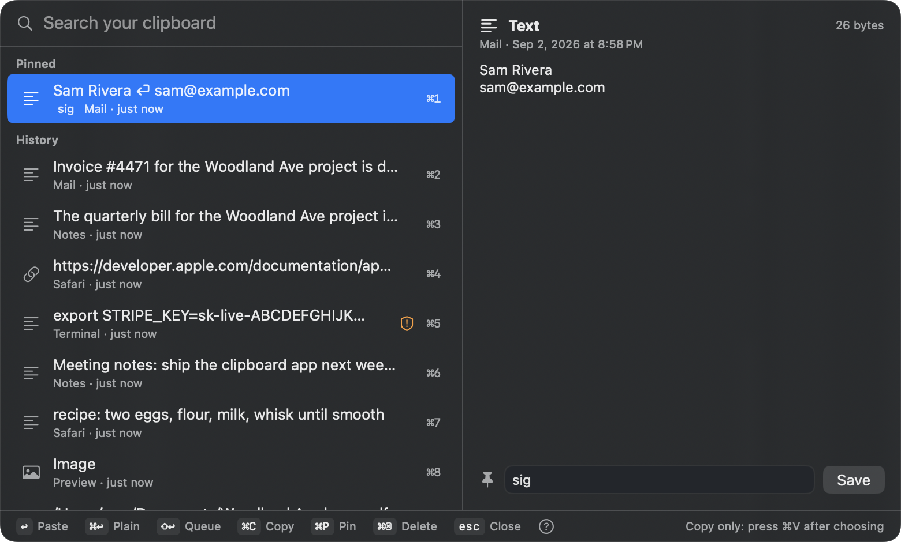
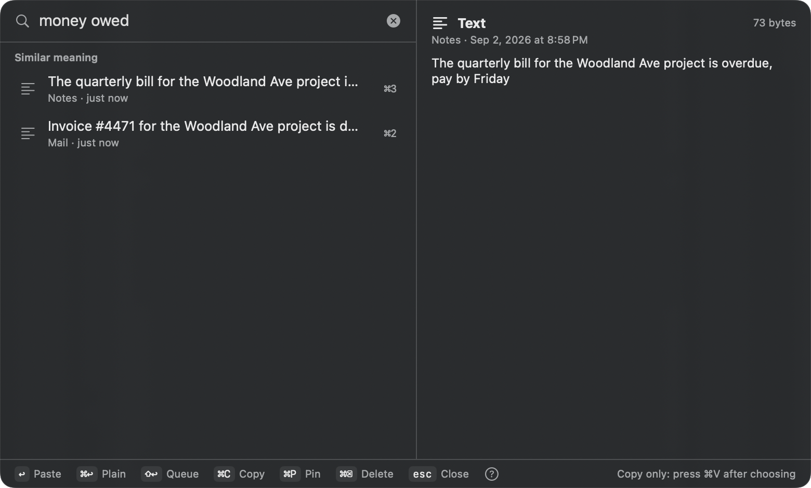
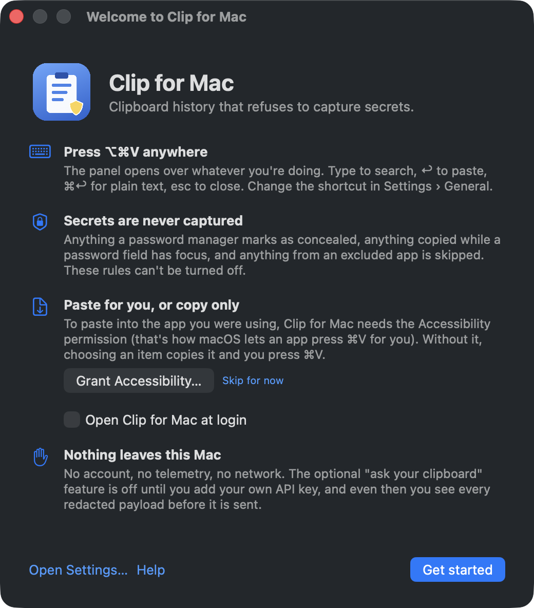
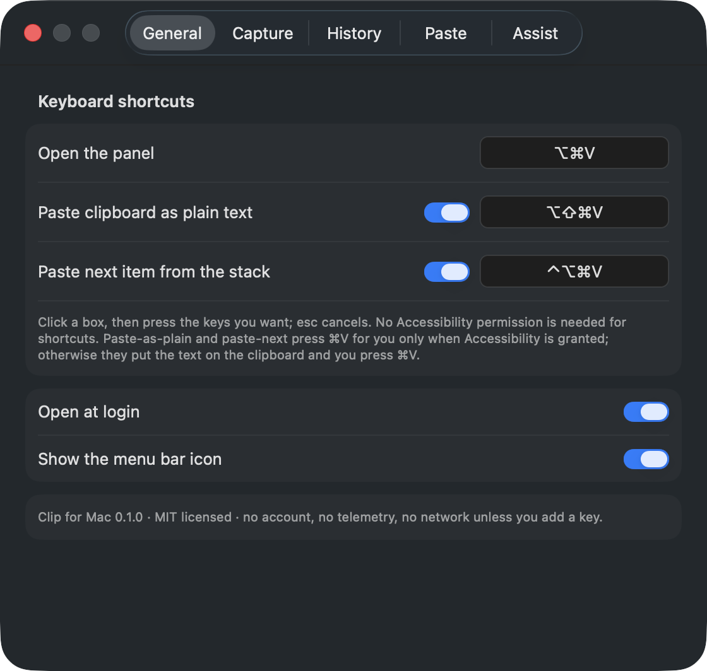

# Clip for Mac

A clipboard history for macOS that refuses to capture secrets. Search everything you've copied,
pin the things you paste every day, and, if you want, ask questions about it without anything
leaving your Mac.

Free, MIT licensed, no account, no telemetry. Same family as [Tidy for Mac](https://github.com/keithadler/tidymac).

<p align="center"></p>
<p align="center"><br><sub>"money owed" finds the invoice and the bill without either word, on-device.</sub></p>

## What it will never capture

These are hard rules, not settings:

- Anything a password manager marks as **concealed** or **transient** (the `org.nspasteboard.*`
  convention that 1Password, Bitwarden, Keychain Access and others follow).
- Anything copied while a **password field has focus** (macOS secure input).
- Anything copied from an **excluded app**. The list ships pre-filled with the common password
  managers and Keychain Access, and you can add any app.
- Anything over the size cap (50 MB by default).

Items that *look* like secrets anyway (API keys, JWTs, private keys, card numbers) are flagged in
the panel and are masked before any optional cloud request. `clipmac forget --sensitive` deletes
them all.

## Using it

- **⌥⌘V** opens the panel over whatever you're doing. Type to search, ↑↓ to move, **↩** to paste,
  **⌘↩** to paste as plain text, **⌘C** to copy without pasting, **⌘1–⌘9** for the top nine,
  **⌘P** to pin, **⌘⌫** to delete, **esc** to close.
- Pinned items sit at the top. Give a pin a keyword and `clipmac snip <keyword>` prints it; the
  menu bar can also export pins as a macOS Text Replacement list so the system expands them.
  Clip for Mac never watches what you type.
- **⌥⇧⌘V** pastes whatever is on the clipboard as plain text, from any app, without opening
  the panel. **⇧↩** in the panel queues an item on the paste stack; **⌃⌥⌘V** pastes the next
  queued item, so you can collect five things and paste them into five fields in a row. All
  three shortcuts are configurable in Settings › General.
- **Pause** from the menu bar or `clipmac pause 30m`. The icon shows the state.
- Search matches words (full-text), fragments (substring) and, with the default on-device
  word embeddings, *meaning*: "unpaid bill" finds the invoice without the word.

<p align="center"> </p>

### Pasting: two honest modes

1. **Copy only** needs no permission. Choose an item, the panel closes, you press ⌘V.
2. **Auto-paste** needs the Accessibility permission, which is how macOS lets an app press ⌘V for
   you. Settings › Paste explains it in one sentence and lets you grant it. Your previous
   clipboard is put back afterwards (adjustable delay, or off).

### Ask your clipboard (optional)

- **On-device model** (macOS 26 with Apple Intelligence): "summarize what I copied today",
  "turn the last five items into a list". Nothing leaves the Mac. Hidden entirely when the
  Mac can't run it.
- **Bring your own key** (Anthropic or OpenAI): off by default. You choose the items, the app
  shows you the exact redacted payload, and nothing is sent until you confirm. Every request is
  logged (`clipmac assist log`). No proxy, no account, no relay through anyone's server. The
  provider bills their metered API, separately from a Claude Pro or ChatGPT Plus subscription.

## Where the data lives, and encryption

`~/Library/Application Support/Clip for Mac/history.db` (SQLite) plus a `blobs/` folder for images
and rich text. Defaults: 30 days, 2,000 items, 1 GB; pinned items are exempt. Deletion is real
deletion. "Session only" in Settings › History keeps everything in memory and forgets it on quit.

**Clip for Mac does not encrypt the database itself.** Full-text search can't index ciphertext,
and shipping half-encryption would imply more than it delivers. It relies on FileVault and says so:
Settings › History and `clipmac status` warn when FileVault is off.

## Command line

```
clipmac list --limit 20 --json
clipmac get 3                      # position 3, or #42 for a stable id
clipmac copy #42 --plain
clipmac search "invoice" --semantic
clipmac pin 3 --keyword sig
clipmac snip sig
clipmac pause 30m
clipmac forget --app com.example.thing
clipmac wipe --yes
clipmac assist "what did I work on today" --local
clipmac assist "group these by project" --cloud --last 20
clipmac assist log --json
clipmac status
```

Exit codes: 0 fine, 1 warning, 2 problem, 64 usage error. `man clipmac` after `--install`.

## Shortcuts and scripts

The `clipmac://` URL scheme drives the running app, so a Shortcuts "Open URL" action or
`open` from a script works without the CLI:

```
clipmac://open                    show the panel
clipmac://search?q=invoice        show the panel with a query
clipmac://paste/42                paste item #42 (add ?plain=1 for plain text)
clipmac://copy/42                 put item #42 on the clipboard
clipmac://pause?minutes=30        clipmac://resume
clipmac://settings                clipmac://welcome            clipmac://close
```

## Privacy

See [PRIVACY.md](PRIVACY.md): what is stored, what is never stored, what leaves the Mac
(nothing unless you add your own key), and the FileVault statement.

## Building

Requires macOS 14 or later and the Command Line Tools (`xcode-select --install`). No Xcode, no
dependencies beyond the system frameworks.

```bash
./build-app.sh --install --run
```

That builds a universal binary, wraps it in `Clip for Mac.app`, copies it to /Applications and
symlinks `clipmac` onto your PATH. Run `./make-local-identity.sh` once so macOS stops re-asking
for Accessibility after every rebuild. `./make-dmg.sh` makes the release disk image;
`./notarize.sh` documents the Developer ID path. See Testing below. `Casks/clipmac.rb` is the Homebrew cask for the first public release.

## Testing

Three layers, one source of truth:

- **Unit suites** live in `Sources/ClipMac/Tests` and run against an in-memory store and a
  throwaway defaults suite, so they never touch your history. Run them from the binary with
  nothing but the Command Line Tools:

  ```bash
  clipmac selftest              # or: clipmac selftest --filter Store --json
  ```

- **XCTest bridge** (`Tests/ClipMacTests`) runs the same suites under `swift test` on any Mac
  with Xcode, which is what CI uses.
- **Screenshots**: `clipmac screenshots docs/screenshots` renders every window with demo data, dark
  and light, without touching real history. That is where the images above come from.
- **Integration** (`tests/integration.sh`) launches the real app with its own data directory
  (`CLIPMAC_HOME`), copies text, links, secrets, concealed items, RTF, images and files, and
  checks what the CLI reports: capture, refusal, dedup, pause, search, pins, forget, wipe.

## Layout

```
Sources/ClipMac/
  ClipMacApp.swift      entry, accessory policy, hotkey registration, retention timer
  Monitor.swift         pasteboard polling and the capture-refusal rules
  Store.swift           SQLite + FTS5, retention, blobs, vectors, request log
  Item.swift            the model
  PanelController.swift non-activating floating panel and keyboard handling
  PanelView.swift       search, list, preview
  Paster.swift          copy-only and auto-paste, restore previous clipboard
  Snippets.swift        pins, keywords, Text Replacement export
  Redactor.swift        secret detection and masking
  Assist.swift          semantic search, on-device model, bring-your-own-key
  Capabilities.swift    what this Mac and this permission set allow
  Hotkey.swift          Carbon global hotkey with conflict detection
  CLI.swift, Dump.swift the clipmac command
  SettingsView.swift, MenuBar.swift
```

## Contributing

See [CONTRIBUTING.md](CONTRIBUTING.md): the seven ground rules that keep the app trustworthy, and
how to add a capture rule, a CLI command, or a language.

## License

MIT. See LICENSE.

## Trademarks

Mac and macOS are trademarks of Apple Inc., registered in the U.S. and other countries. Clip for Mac
is an independent open-source project and is not affiliated with, endorsed by, or sponsored by
Apple. 1Password, Bitwarden, Raycast, Maccy, Paste and other names are trademarks of their
respective owners and are used only to identify those products.
